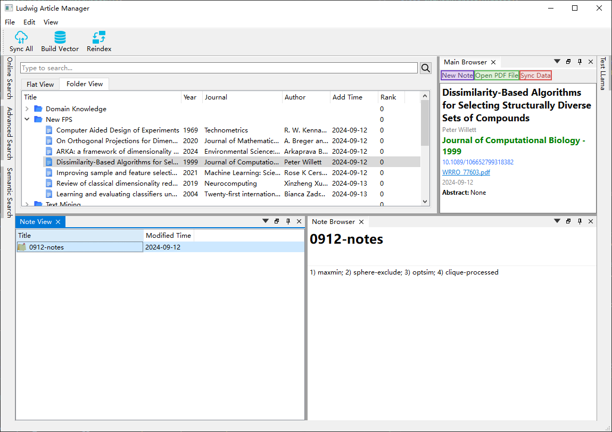
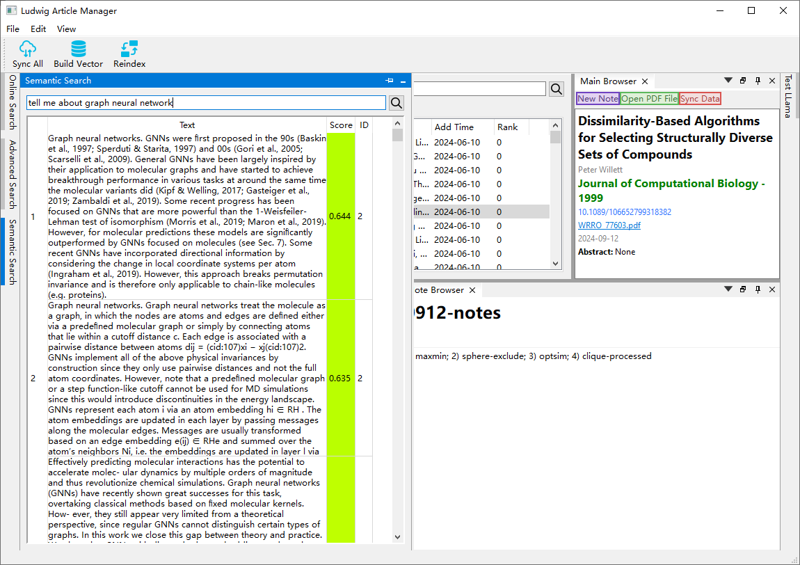
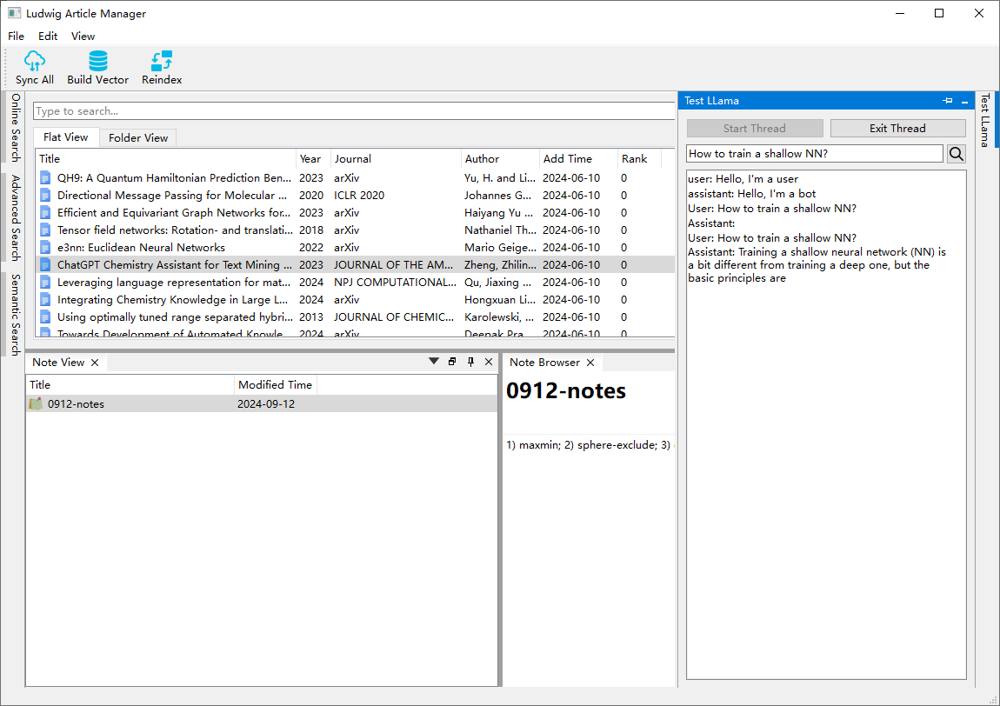

# Ludwig Article Manager

I’d like to construct a manager with an auto RAG system enhanced by a local LLM, or LLMs like GPT-4 or Claude. I'm also adding online search and an auto annotation feature. However, it's still unfinished! There’s a lot of effort needed after squeezing all my spare time into this.

Right now, it feels more like an exercise in Qt UI. :(

I have updated this project with some additional features, making it more interactive. It now supports simple literature management, including a tree view, and allows viewing and modifying the corresponding literature metadata.

I added several web search tools, including simple HTTP searches and automated searches using Selenium. This supports well-known websites like Google Scholar, WoS, CrossRef, and arXiv, although WoS requires an account 😭. However, pulling abstracts and other information from WoS is quite easy. For details, see `/tools/web/webfuncs.py`.

I also implemented a preliminary RAG system. While it lacks a G system as it does not have LLM-enhanced generation, it handles internal PDF literature preprocessing, segmentation, and embedding. Currently, it supports simple semantic queries for quickly finding highly relevant paragraphs. The segmentation results could be improved.

Finally, I set up a temporary Llama model for streaming Q&A. :P

I'll be busy with other things soon.
