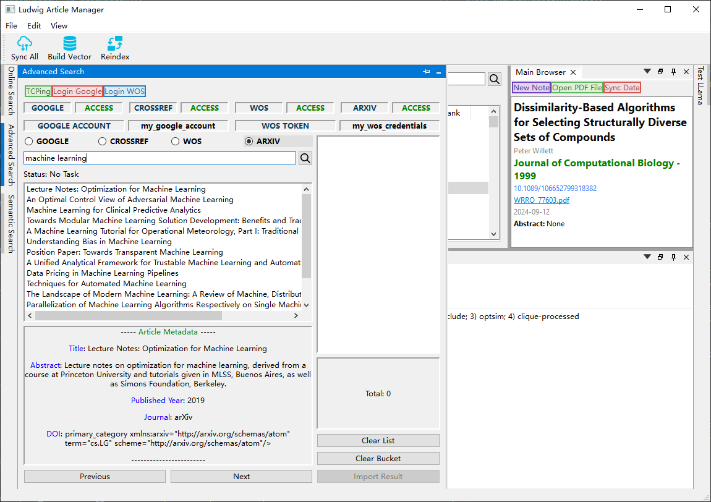

# Ludwig Article Manager

I’d like to construct a manager with an auto RAG system enhanced by a local LLM, or LLMs like GPT-4 or Claude. I’m also adding online search and an auto annotation feature. However, it's still unfinished! There’s a lot of effort needed after squeezing all my spare time into this.

Right now, it feels more like an exercise in Qt UI. :(

